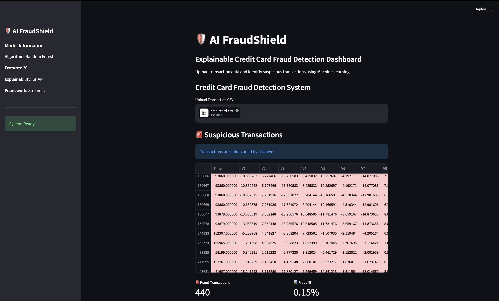
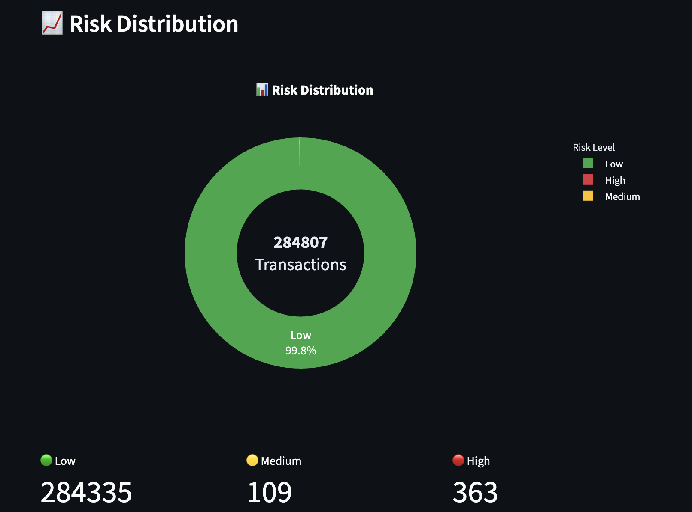
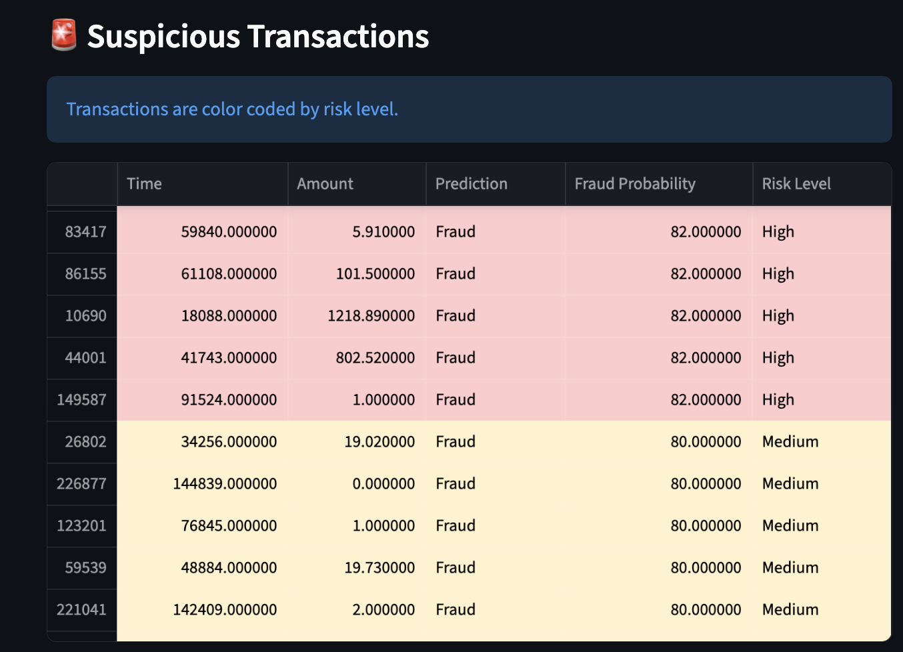
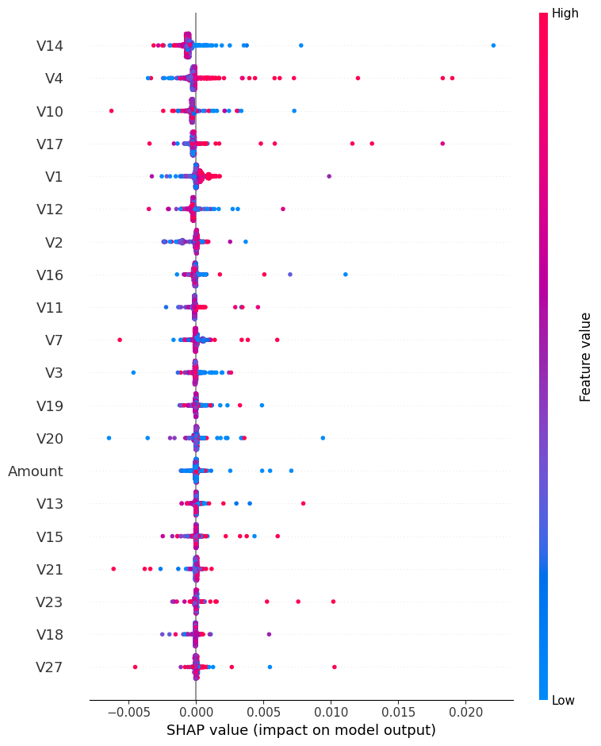
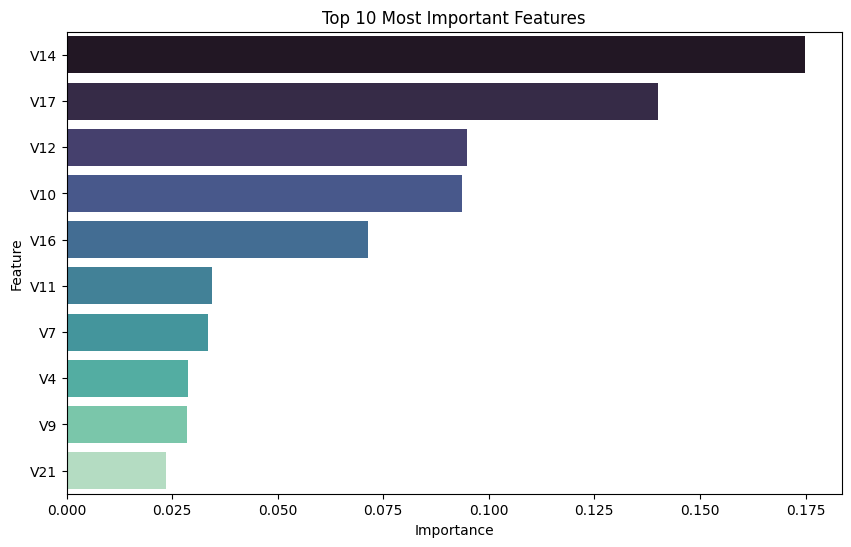

# 🛡️ AI FraudShield

An Explainable Credit Card Fraud Detection Dashboard built using Machine Learning, SHAP Explainability, and Streamlit.

## 📌 Overview

Credit card fraud causes significant financial losses every year. Detecting fraudulent transactions accurately while minimizing false alarms is a major challenge for financial institutions.

AI FraudShield is an end-to-end machine learning solution that analyzes transaction data, predicts fraudulent activity, assigns risk levels, and provides visual explanations through an interactive dashboard.

---
## Dashboard Preview



## Key Highlights

- Built an end-to-end Machine Learning pipeline
- Implemented SHAP-based Explainable AI for model transparency
- Developed an interactive Streamlit dashboard
- Generated fraud probability scores and risk levels
- Enabled CSV-based transaction analysis and reporting

## 🚀 Features

* Credit card fraud detection using Random Forest
* Fraud probability scoring
* Risk level categorization (Low, Medium, High)
* Interactive Streamlit dashboard
* CSV transaction upload
* Downloadable analysis reports
* Feature Importance Analysis
* SHAP Explainability
* Risk Distribution Visualization
* Color-coded suspicious transaction table

---

## 📊 Dataset

The project uses the Credit Card Fraud Detection Dataset containing anonymized transaction features:

* Time
* Amount
* V1–V28 anonymized PCA-transformed features
* Class (0 = Normal, 1 = Fraud)

The dataset is highly imbalanced, making fraud detection a challenging classification problem.

---

## 🔍 Project Workflow

1. Data Cleaning
2. Duplicate Removal
3. Missing Value Handling
4. Outlier Detection and Treatment
5. Feature Scaling
6. Model Training
7. Model Evaluation
8. Explainability Analysis
9. Dashboard Development

---

## 🤖 Models Used

### Logistic Regression

Used as a baseline model for comparison.

### Random Forest Classifier

Selected as the final model due to its strong fraud detection performance, high precision, and ability to provide feature importance insights.
---

## 📈 Model Performance

### Random Forest

* Precision: 1.00
* Recall: 0.73
* F1-Score: 0.85

The model achieved strong fraud detection performance while maintaining high precision and interpretability.

---

## 🧠 Explainable AI

To improve transparency and trust in predictions, SHAP (SHapley Additive exPlanations) was used.

Key insights:

* V14 was the most influential feature
* V17, V12, and V10 also contributed significantly
* SHAP visualizations explain how individual features influence fraud predictions

---

## 📷 Dashboard Preview

### Main Dashboard


### Risk Distribution



### Suspicious Transactions



### SHAP Summary Plot



## Feature Importance



---

## 🛠️ Tech Stack

* Python
* Pandas
* NumPy
* Scikit-Learn
* SHAP
* Plotly
* Streamlit
* Matplotlib

---
## 📁 Project Structure

```plaintext
credit-card-fraud-detection/
│
├── assets/
├── data/
├── notebook/
├── app.py
├── fraud_model.pkl
├── requirements.txt
└── README.md
```

## ▶️ Installation

Clone the repository:

```bash
git clone https://github.com/AayushiSud06/credit-card-fraud-detection
```

Install dependencies:

```bash
pip install -r requirements.txt
```

Run the dashboard:

```bash
streamlit run app.py
```

---

## 🎯 Future Improvements

* Real-time transaction monitoring
* Bank API integration
* Advanced anomaly detection models
* Live fraud alert system
* Cloud deployment

---

## 👩‍💻 Author

Aayushi Sud

B.Tech Computer Engineering: TIET'28 | AI/ML Enthusiast

Built as a portfolio project to demonstrate machine learning, explainable AI, and deployment skills.
